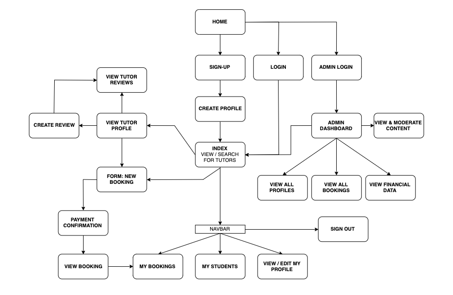
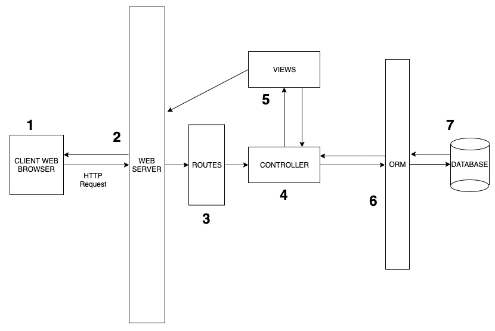
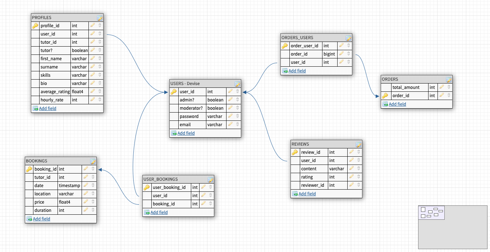

# CodingTutor 

[GithHub Repo](https://github.com/JoshTeperman/rails_coding_tutor)\
[View Live Application](https://vast-citadel-37963.herokuapp.com/)
trello

---
## Contents
<!-- links  -->
**[Section 1: Description](#description)**\
**[About](#about)**\
**[Tech Stack](#tech-stack)**\
**[Configuration](#configuration)**\
**[Section 2: Design](#description)**\
**[Wireframes](#wireframes)**\
**[ERD](#erd)**\
**[The Database](#the-database)**\
**[User Stories](#user-stories)**

## Section 1: DESCRIPTION

### __About CodingTutor__
<!-- General description of the app, its features-->
<!-- Screenshots -->
CodingTutor is a Code Mentoring and Tutoring platfrom built for and by Australian Programmers. Inspired by open source and private projects that operate globally but under-represent Australian developers, CodingTutor is an open-source project built to foster the development of the next generation of Australian software engineers.

In current version 1.0 users create a default account (Student), and can opt in to creating a Tutor account, adding their profile to the list of Tutors students can book coaching with.  

### __Tech Stack__    
- Front-end: HTML, ERB, CSS, Sass, Javascript
- Back-end: Ruby, Ruby on Rails
- Database: PostgreSQL Database with ActiveRecord
- Deployment: Heroku

### __Configuration / Installation Instructions__
Gmail account
  - emailress: ca.codingtutor@gmail.com
  - password: nl*V@hKGZ1I6

---
## Section 2: DESIGN

### __Design process__
Market Research:
Talking to Developers
Researching similar platforms

### __User Journey__

### __Features__

---
## Section 3: PROCESS
- project plan & timeline
- Screenshots of Trello board(s)
- GitHub
- Progress

---
## Section 4: SHORT ANSWER QUESTIONS

### 1) What is the need (i.e. challenge) that you will be addressing in your project?
The need we are addressing is reducing the friction in finding coaching, and teaching & monetization opportunities for Programmers in Australia. 

Most people don't know how to find a mentor or don't have the time. The best way to find a mentor will always be through developing real relationships and trust with people in your own network, however traditional networking still limits you to who you know, and possibly second degree connections, or 'friends of friends'. 

In the same sense, many experienced Programmers want to give back to the community through mentoring or coaching, or possibly start a coaching or consulting business for some side income. 

Our project attempts to provide a platform where these two groups of people can find each other more easily, and facilities their interactions and transactions.

### 2) Identify the problem you’re trying to solve by building this particular marketplace App? Why is it a problem that needs solving?

The justification for a service that bring mentors and mentees together is well established. The problem for Australian engineers is a lack of options that are built with them in mind. We know this because:
- a) We asked around - through networking and speaking to our peers, we found that almost unanimously juinior developers were looking for mentoring, and a good number of senior developers with either looking for a way to give back or wanted options for side-income.
- b) We are scratching our own itch - When looking for mentors in Melbourne we couldn't find a platform that had a lot of options for finding local mentors in Melbourne or that was easy to use. 

There are already a plethora of established options for Programmers to find each other - Social Media platforms like LinkedIn, Facebook & Twitter, Tech crowd-sourcing platforms like AngelList, Freelancer, TopCoder - even mentoring platfroms in the mould of our platform like CodingCoach and CodeMentor - however none of these lived up to our idea of what a platform for Australians should look like. Either they were too social / had too much noise (social media), provided outsourcing services but didn't encourage mentoring (Freelancer etc), or were exactly what we were looking for but had almost no Australian options (CodingCoach, which has 3 Australians on the platform!).

There is clearly a need for these types of platforms, but nothing that is meeting our needs, as Australian Programmers.

### 3) Describe the project will you be conducting and how your App will address the needs.

At scale, a two-way marketplace is the most efficient way for tutors and learners to find each other and transact, and should enhance traditional mentor / mentee relationships and freelancing for developers.

CodingTutor will be a two-way-marketplace Mentoring and Tutoring platform built in the mould of CodingCoach or CodeMetor, but with customised for Australians. 

Mentees will be able to view a full list of Developers who have signed up for a Tutor account, search and filter by skill / language, location, and reputation, book a session by themself or teaming up with other students as a group. 

Tutors will be able to curate their profile, offer their services and set their own prices, and manage the entire interaction within stedents within app. They will receive reviews similar to LinkedIn's Recommendations feature and thus will be rewarded for quality, increasing the amount of interest they receive from other students.

Both Tutors and Students will have the option of making their account private, simply by disabling the "Tutor" option on their profile, while still recording their history of Tutoring Sessions, their notes, and their lists of Students and Tutors. The platform should allow anyone to use it flexibly, choosing when, where and how they interact with others, and whether they choose to monetise their relationships or not. 

### 4) Describe the network infrastructure the App may be based on.

Our application is deployed through the Platform as a Service (PAAS) Heroku, a popular software product that allows developers to push code directly from GitHub to the internet via Heroku's deployment platfrom and network infrastructure. 

Heroku can be accessed either directly from GitHub or through the Heroku Command Line Interface (CLI), and allows developers to spin up an application quickly and for free without needing to purchase their own servers or deploy their own database / network infrastructure. 

Our app is deployed through the following process:

__APPLICATION DEVELOPMENT PHASE__
- Software is developed on local computer using Ruby on Rails and deployed for local testing using inbuilt Rails Server (which hosts the application at a localhost port)
- We write the source code, configure dependencies, configure the database
- We store the code in a GitHub repository, both as a means of Version Control, and in preparation for Deployment

__APPLICATION BUILD PHASE__
- When our application is ready, we create a new app on Heroku and push the code in our GitHub repository directly to Heroku so that Heroku can prepare it for deployment
- Heroku receives the code and initiates the build process
- Heroku bundles assets necessary to run the application, like the your compiled code, and combines this them with the application to create a 'slug', which describes the bundled file that’s ready for deployment.

__APPLICATION DEPLOYMENT / EXECUTION PHASE__
- Heroku executes the slug using a mini-operating system called a Dyno, an isolated Unix container that provides an environment for the app to run in. Dynos are the resources that are needed to run and manage your app when it is deployed on Heroku's servers. To scale the app in the future you can add more Dynos, and this is all executed in the background. 
- Heroku then applies to the slug environment variables from your config vars file that describe things like user credentials or other environment specifications, and finally any add-ons or third party services that extend the functionality of the application.
- Heroku delivers the final product containing the slug, config, and any add-ons, as a 'version' of your code. Any new release will be considered a new version of the application, and saved by Heroku.

### 5) Identify and describe the software to be used in your App.
Software Languages:
- Front-end: 
  - HTML: HyperText Markup Language. A language used to constract web pages. Used mostly for structure, capable of basic styling for elements.
  - ERB: Embedded Ruby. Used to write ruby logic directly in an HTML page that compiles and is read by the browser as HTML.
  - CSS: Cascading Style Sheets. Language used to 'style' a web-page. Makes HTML look pretty. Mostly styles static elements, though can be used to create minimal animations.
  - Sass: Syntactically Awesome Style Sheets. Adds some additional features to CSS while also able to be written as standard CSS. Additional features include, variables, nested elements (for cleaner organisation and grouping of elements), mixins (methods)
  - JavaScript: A flexible Object-Oriented-Language. The most popular language for writing front-end code in web development. Most advantageous use-case is allowing for animation of elements, responding to events like onClick, and dynamically transforming the data on a web-page without querying the database.
- Back-end: 
  - Ruby: Another flexible Object-Oriented-Language. Cannot be used to write front-end code, but is very commonly used to write business and other back-end logic in web applications. 

Software Frameworks:
- Ruby on Rails: Web application framework written in Ruby. Used to create full-stack web applications. MVC (Model Controller View) framework using separation of concerns. Emphasises CoC 'Convention Over Configuration', in other words is meant to be able to be used out of the box with conventions specific to RoR, and a large degree of abstraction to automate many technical or time-consuming aspects of building a web application, like spawning databases and writing database migrations, creating controllers, views, routes, and handling different types of HTTP requests.

Database Software:
- PostgreSQL Database: A popular Relational Database Management System based on the SQL Database Language. Data is strutured in a way that allows for queries based on data objects and their relationships with each other, written natively or through an ORM.
- ActiveRecord: An ORM 'Object Relational Mapping' tool. Abstracts SQL query language so that code can be written in another language like Ruby, and used to speak to the database and request information. 
- Rake: Software Task Management and Build Automation tool written in Ruby. Can be used to define various tasks used in configuring software build, file compilation, database creation and management.

Version Control:
- Git and GitHub: Source Control software. Open-sourced popular software development tool that allows for either single programmerse to work on their local machine, or remote teams to work together on a project using the GitHub Web Application connected to a local CLI Command Line Interface. Most popular features are the ability to 'commit', or save a piece of software at a certain 'state', which can be returned to at a later date. Also allows asynchronous development of applications and features using 'branches' of software that are written concorrently but don't affect the core branch unless merged at a later time. 

Deployment: 
- Heroku: A popular Platform as a Service (PAAS) product that allows for deployment of web applications without owning your own database or server infrastructure. Users can push code in many different languages directly from GitHub to the internet via Heroku's deployment platfrom where it handles building and deployment of the application.

_For other third party software, please see Third Party Services._
<<<<<<< HEAD
=======

>>>>>>> c80ba25fae6042020ee87ecfd99239a8ae83d96c

### 6) Identify the database to be used in your App and provide a justification for your choice.

We used PostgreSQL for our application, for a few different reasons:
- We wanted to use an SQL-language database. SQL databases arethe most popular by far which means they have significant documentation available on the internet and should be easy to troubleshoot.
- PostgreSQL is a relational database, making it easy to manipulate and access data. 
- PostgreSQL works very smoothly when building an app with Ruby on Rails, and deploying to Heroku.

### 7) Identify and describe the production database setup (i.e. postgres instance).
We are using an instance of a PostgreSQL database. 
PostgresQL - 
Production - heroku rails db migrate - 
how the database is set up for you - (local and then how you set it up in heroku )

### 8) Describe the architecture of your App.

__Application Architecture Diagram__
 

1) The Client...
- Displays the web page in a web browser
- Handles User Interface and user interactions with the web page.
- Sends and receives HTTP requests to and from the web server by interacting with the web page.

2) Web Server
- Processes HTTP requests and directs the request to the requested Route.

3) Routes
- A map of pathways defined by the application that define which functions are called in the controller depending on different requests from the server
- Most common HTTP requests are:
  - GET (request information from the database)
  - DELETE (delete information in the database)
  - POST (send new information to the database)
  - PATCH / UPDATE (update / change existing information in the database)

4) Controller
- The location of the logic of the application. Contains functions that are called by requests from the web server 
- Functions either:
  - query information from the database 
  - request files required to load a certain web page, or 'view'
  - call information from external APIs or other web services
  - parses or formats ready to be used in some following function or view
  - run other types of logic specific to the application
- Tells the web server how to display web pages with information received from the Database or 

5) Views
- The final representation of the initial request from the client. 
- Tells the browser what to display to the user. Can be in many different formats, including HTML & CSS, JSON, Images, Pdf etc

6) ORM
- Parses code from the controller to native SQL language.
- Allows the appliation to set and retrieve properties and relationships of database models (data)

7) Database
- PostgreSQL relational database that stores persistent information used by the application.

### 9) Explain the different high-level components (abstractions) in your App.
- Active Record
- HTML ERB
- Ruby on Rails 
  - forms
  - 
- 

### 10) Detail any third party services that your App will use.
Services:
- S3 Module: Image Storage from Amazon Web Services
- Stripe: Payment processing Software as a Service (SASS) from Stripe. Allows users to pay for products or services within the app using credit card. 
- Mailgun: Creates and sends email from a specified account to registered users, triggered by certain actions defined within the application.

Gems / Modules:
- Bootstrap: Software component library built by Twitter
- Font Awesome: SVG Icon library
- Devise: User Authentication module used to manage user registration, sign-in, passwords, confirmation etc
- CanCan: Authorizations module used to define the scope of actions available to specific classes of users defined within the application
- Faker: Used to generate random data for the database.

### 11) Describe (in general terms) the data structure of marketplace apps that are similar to your own (e.g. eBay, Airbnb).
https://codingcoach.io/
All data is hosted through GitHub Pages. Theis app functions only as a portal for developers to search and contact mentors. There is no payment mechanism, messaging, or anything beyond the search feature so they don't need to store or manipulate data beyond user profiles. 

https://www.codementor.io/
This app provides a range of different services beyond simple Profile Search. There are different tiers of login, places to post content, payment portal for services, reviews etc etc. Therefore they are using some type of database, most likely hosted on their ow server or on a powerful SaSS like Amazon Web Services. Their code will be complex, most likely structured to account for a large range of database model relationships (Users having many teachers, teachers having many reviews).

### 12) Discuss the database relations to be implemented.
We used a range of database relations. 
Users have a single profile, many reviews, many bookings and many orders. Therefore to describe the other side of those relationships, profiles, reviews, bookings, and orders all belong_to user. For the Users > Bookings and Users > Orders relationships, both are defined by a single additional instance, a User_Booking or a User_Order, therefore we used has_and_belongs_to_many. 

<<<<<<< HEAD
=======

>>>>>>> c80ba25fae6042020ee87ecfd99239a8ae83d96c

### 13) Describe your project’s models in terms of the relationships (active record associations) they have with each other.

We used the following active record associations:

__User__
- has_many :user_bookings
- has_many :bookings, through: :user_bookings
- has_one :profile
- has_many :reviews
- has_and_belongs_to_many :orders

__Profile__
- belongs_to :user

__Booking__
- has_many :user_bookings
- has_many :users

__User_Booking__
- belongs_to :user
- belongs_to :booking

__Review__
- belongs_to :user

__Order__
- has_and_belongs_to_many :users

__User_Order__
- belongs_to :user
- belongs_to :order

### 14) Provide your database schema design.
[View at dbdesigner.net](https://www.dbdesigner.net/designer/schema/243055)

### 15) Provide User stories for your App.

__USER STORIES__

1) *"As a Guest (User who is not signed in), I should be able to ..."*
- View the Home Page, read about the app's purpose and it's basic functionality
- View a clear call to action on the front page 'Find a Tutor' that links to the Index/Search page. 
- View more information / tutorials on how to use the app, including what it means to be a tutor
- View Contact Details to get in touch with the creators and find out more
- Create a new Account with an email address and password, and receive and email to confirm creation of my new account
2) *"As a Student (Normal User), I should be able to ..."*
- Login and create a Profile, write a bio, list my skills, and upload an optional avatar photo. Edit my profile at any time
- Use a default profile avatar photo
- View all of the Tutor's active on the platform, including their profile details (bio, skills), as well as hourly rate. 
- Select a tutor and create a new booking with that tutor. 
- Have the booking price be calculated automatically based on the duration and tutor's hourly rate. Pay for the booking using Stripe and my Credit Card, and view a confirmaton screen when the payment has been processed. 
- Write a review for any Tutor. 
- Edit or cancel any (and only) bookings I am a participant in
- Review my past bookings and upcoming bookings, whicih includes booking data and time, tutor name, and students who participated in the booking
- Edit / Delete and (and only) reviews I created
- Have the option to create a Tutor account by checking a box on the Create Profile page

3) *"As a Tutor, I should be able to ..."*
- Have all the same functionality as a normal user (Tutors can be Students as well)
- Decide at any time whether uncheck the tutor option, which hides my profile from the Tutors index page. I should still be able to see my tutor history (my students, past bookings) in my own private page. 
- View my student profiles (cannot see profiles of users who are not my students)
- View reviews of myself

4) *"As an Administrator User, I should be able to ..."*
- Edit / Delete content, including reviews and bookings
- View an Administrator Dashboard
- View all profiles and all bookings
- View financial data

5) *"As a Moderator User, I should be able to ..."*
- Edit and delete reviews only

__Bucket List User Stories for Version 1.1__

*"In the next version of our app, users should be able to..."* 

1) __Normal Users__
- Search / Sort / Filter Tutor Profiles based on name, skills, location
- Add multiple students to a booking
- Request changes to a booking and have Tutors accept or reject changes
- Send messages to other users
- Follow or 'favourite' tutors
- Make a complaint about a tutor who behaved inappropriately
- View Notifications (inbox message etc)
- View upcoming bookings in calendar style
- Directly add bookings to Google Calendar 
- Set up video calls directly through the platform
- Set up recurring meetings 

2) __Tutors__
- Confirm or reject changes / requests for new bookings before a booking can be created
- Create and review lesson notes
- Append notes to students 
- Review financial data

3) __Administrators & Moderators__ 
- Admins create Moderator users
- View detailed user stats (filter by location, skills, activity etc)
- View user history
- Receive notifications for flagged content, 
- Moderators can escalate issues to Moderators

### 16) Provide Wireframes for your App.
[View at Figma.com](https://www.figma.com/file/N3IWB9shy8LfcphJliE2F1rz/Rails_Project?node-id=72%3A117)
Here are a few screenshots of Wireframes for our App : 
1) (https://raw.githubusercontent.com/JoshTeperman/rails_coding_tutor/master/Wireframe-1.png)
2) (https://raw.githubusercontent.com/JoshTeperman/rails_coding_tutor/master/Wireframe-2.png)

We planned and design the architecture for all the html.erb files that we created. 

Then we started out by sketching the structure of our app. Link to our sketches are down below :
1) (https://raw.githubusercontent.com/JoshTeperman/rails_coding_tutor/master/Building%20Process-2.jpg)
2) (https://raw.githubusercontent.com/JoshTeperman/rails_coding_tutor/master/Building%20Process-1.jpg)

We've also created to different views (logged in versus logged out view), to outline how the structure of our page would appear in different circumstances. 

1) The first one is the homepage, which consists of a description of our website/app, it navigates user to the login && sign up page, as well as the search page. 

2) Next is the search page,( index.html.erb of PROFILE model) which is comprised of a list of tutor profiles which allows users(aka students) to look for a suitable tutor. 

3) We also planned all the structure and how the CRUD elements are supposed to fit together in different pages (
  create a new profile page, show your profile page, edit own profile page.)

4) We also planned the core structures for all other models (Booking, Review..etc), as well as the sign up and log in page.

### 17) Describe the way tasks are allocated and tracked in your project.

  Trello has played an important role in allocating and tracking our tasks throughout the rails project.
  We separated our work into different categories (Trello cards) such as to-do-list, doing list, finished list, user stories list, and finally the wish list. We update our to do list everyday, as it is the easiest way to stay on top of our deadlines and tasks. We also tend to mark and update all our lists once any individual item on it is completed. We can always see what needs to be done, for example we aim to get the MVPs done, and only then we plan to add extra features after completing the core structure of our app. Since day one, we started listing all of our tasks and we also added due dates to complete them. For example we set a due date for our MVPs, and thus allowing us to have extra time to double check for any bugs, as well as allocating some days left for styling. What we've done were also to discuss the priority for each day in the morning, and then constantly check our trello to ensure that we are on track, as well as to remove any nonessential tasks. Nevertheless, we also tend to break up bigger tasks into smaller ones in order for us to manage our tasks more efficiently. On top of that, we also used google docs to write notes on the things that we were working on, to group the different sections of our app and list out all the small details that are related to a particular page (eg Profile model should have an index page that serves as a search page, Booking model should have...and so on). 

### 18) Discuss how Agile methodology is being implemented in your project.
  
  During the two weeks of working on the Rails project, we implemented standups every morning, in such a way that we discuss what we worked on the day before, what we will be working on today, and what are our blockers at the moment. This allows us to break down the important things to do in more manageable units, making it efficient and clear for my team to focus on high-quality development, and also to improve collaboration. These daily standups are also important in keeping all team members equally informed and updated on the status of the project.

  In addition, at the start and end of every day, my partner and I will always make sure to define our daily goals, and to make decision together especially when prioritizing the features to implement in our project. By using Trello, we keep track of the fundamental things that we were required to do and we made sure to write all the details that accumulates and contribute to the overall functionality of our project. 

  Moreover, we tend to divide our work and task equally as we were focusing on creating a shared sense of ownership and goals for our team. This kind of method gave a sense of purpose to our team, rather than creating a false sense of urgency. Being purposeful definitely made us more productive as we became more eager to challenge ourselves to be faster and more efficient. 

  Other than that, we also listed out the user stories && tutor stories by trying to use our app in a user's perspective. This allows us to outline the structure of our app, in terms of the design planning, the architecture, the functionality, the features, and all the other small details that a user will prefer to have when using our app. Therefore, by focusing on the user’s needs, each feature that we've built delivers real value and not just an IT component. It provides a better opportunity to gain vital feedback earlier in the project so that any additional modification can be made as needed.

### 19) Provide an overview and description of your Source control process.

  Since the start of the project, my partner and I have worked together and stored our works on github. Initially we have to decide on who to create a repository on github, and then we will create a separate branch from master in order to push our work to the branch and merge it later. By the end of the day, we tend to git add and git commit our work and push to github at least a few times per day. If we have any merge conflicts, we usually solve it together to ensure which specific version is the latest one. In addition, we also tend to double check pull requests before merging, and then finally pull to our master in our local machine. This allowed us to compare changes over time, see who last modified something that might be causing a problem, which files introduced an issue and when, and more. Using github also allows us to store our files in github and hence if we unintentionally screw things up, we can still easily recover them. 

### 20) Provide an overview and description of your Testing process.

  We did some manual testing by going through the whole list of user stories one by one. For example, a student wants to be able to : 1) Create an account, 
       2) Login and check bookings,
       3) Edit bookings (edit / cancel etc)
       4) Edit profile (login details, picture, skills, about me)
       5) View Tutors 
       6) Make a booking / Make a payment
       7) Make reviews

  On top of that, we also did manual testing for tutor stories, and we also tested on every page of each Model's Crud. 
  Eg :     PROFILE Model - Index (search page)
                          - Show (specific user profile + all reviews + add review form)
                          - New (new profile form - after signing up / confirmation)
                          - Edit (edit profile)

  We did all of the manual testing for all the models and controllers that we created (Profile, Booking, Rewiew, Page, User_booking, User, and others.)

  In addition, we also did can can authorization testing to check if it works, for example :
    1) Logged out users can’t create bookings or reviews
    2) Logged out users can create Profiles
    3) Logged out users can view profiles and reviews
    4) Logged in users can’t Edit / Delete reviews of others
    5) Logged in users can’t Edit / Delete bookings of others
    6) Logged in users can’t Edit others’ Profiles
    7) Logged in users can only see Edit / Delete buttons of other users

 Moreover, we also did manual testing for DEVISE Tests to see whether it works for :
    1) Sign up 
    2) Log in 
    3) Format of email during sign up
    4) Check whether password and email are updated in the database

### 21) Discuss and analyse requirements related to information system security.

  The three main requirements related to information systems security are confidentially, integrity, and availability (CIA). The basis of an organization's security depends on a properly developed, well designed and good implementation of information systems' security policy in order to balance security goals with the needs of an organization.

  Confidentially is the main goal of information system security. It refers to preventing confidential information from falling into the hands of unintended and unauthorized users. There are alot of different types of threats that might directly, or indirectly affect the users such as theft of intellectual property, identity theft, theft of equipment or information, sabotage etc. 

  Next is Integrity. It refers to preventing unauthorized alteration and modification of data and programs that were made either by unintended users such as hackers, or by authorized users making unauthorized, illegal modifications.

  Lastly is Availability. It refers to the preservation of data and resources available for authorized use, especially during emergencies, disasters or equipment failures. 

### 22) Discuss methods you will use to protect information and data.

  In order to prevent the exploitation of confidential information from users, the best way to do this is to implement encryption processes for passwords, as well as develop access controls such as antivirus software, firewall and so on.

  The prevention of illegal modification of data by both unauthorized and authorised users is important to maintain an organization's integrity. Hence, one should implement a backup policy to protect against corruption or accidental loss of data. 

  The requirements regarding availablity can be tackled by developing a disaster recovery plan to ensure that the organization can continue to exist in the event of a disaster or loss of access by personnel.

### 23) Research what your legal obligations are in relation to handling user data.

The Privacy law involves the legal obligations that regulates the collection, storing, provision of access and the management of personal information on all individuals. While handling user data, the legal obligations are that we have to consider the safety of personal information about our users from threats such as hackers, cyber thefts and so on. One of the things we should consider for our app is to provide an in-app disclosure of the data collection and use. 

Moreover, we also have to be transparent in how we handle user data, for example the collection of information about a user. That means disclosing the collection, use, and sharing of the data, and limiting the use of the data to the purposes disclosed, and the consent provided by the user.

Furthermore, we are also obligated to protect systems’ and individual files with authorization and authentication. This can be done using can can in order to implement an ID and password in order to use our app. We are also required to manage access rights, for example unauthorized user cannot modify any of the details in our app. Encryption og passwords, files, and important datas at all times, especially when wireless devices are used, and keep track of wireless connectivity to prevent accidental file sharing. Another thing we could do is also to keep a record of the timestamp (date and time) when a piece of electronic data was originally recorded to prevent any unintentional modifications, alteration or manipulation at a future date. 

It is also a must to update virus protection on a regular basis to prevent vulnerability of data, as well as limiting the physical access to booking details (location, date.. etc) which could potentially be dangerous if unintended users have access to all these info.

In addition, it is also important to develop a back up plan or a disaster recovery plan to ensure data recoverability in case of emergencies. This can be done by creating backups of multiple copies in secured multiple locations. 

---
## Section 4: Reflection
### Challenges 
- what was difficult?
### What we learned / What would we do differently next time
Write the readme first - Questions like these help to clarify the purpose of an app and aid in decision making and direction of the project:
- what problem are we solving?
- how do we know that problem exists?
- why do we need to build this app in particular, to meet that need?
- what are we doing differently from other solutions to this problem?
- what features are needed to solve this need?
Bootstrap Styling
- either user Bootstrap for everything, just for mock-up (then replace with natively styled elements), or in very limited capaicty (buttons, navbar etc)

### Extending the App
- what features would we add? 
### Maintenance
- any requirements for ongoing management of the app

--- 
## Section 5: Appendix

### SINGLE PAGE SCROLLING
https://www.uxpin.com/studio/blog/4-types-creative-website-scrolling-patterns/
> We have selected a fixed long-scrolling pattern for displaying content on our website. Long-scrolling is suitable for applications where the content of the webstie is either a) user generated and therefore constantly being updated b) either diverse and difficult to categorise or alternatively all of a particularly type and can be listed all together, as is the case with our site. 
> Long-scrolling pattern websites have the downside of becoming difficult to navigate, particularly when trying to 'go back', or return to a previous point. To combat this we have adopted fixed menu bars and search filter for the Search page, and fixed return buttons for the Home page. 
> Fixed long-scrolling websites provide some additional structure to a long-scrolling pattern - suitable for an About Page / Sales Page / Tutorial Page that describes a product or service to a new user, with CTA at the end of each section and # links to each section. This format replaces a multi-page format with a single page but avoids users getting lost by keeping some structure.
> Consider some indicator of scrolling progress for the user so they know how far they've scrolled (scrollbar etc)
> Single-page scrolling can affect SEO results (Mitigation: http://www.quicksprout.com/2014/05/21/how-to-create-an-seo-friendly-infinite-scrolling-page/)
> Can combine long scrolling with link-out to secondary pages (www.facebook.com)(www.twitter.com)(www.linkedin.com)
> Consider Infinite Scrolling for search results (limit initial view to X results, load more on scroll)

References: 
https://www.uxpin.com/studio/blog/4-types-creative-website-scrolling-patterns/

### SEARCH / FILTERING
Challenge / Goal:
- App users need a way to find the right tutor for them, either with a targeted search for a specific tutor (search by Name), or with a filter (search by skill / language, location)
- Therefore we need 
  -- Keyword search (limited to specific scope / field)
  -- Filters (predefined and given to the user)
  -- Easy to use UI (look at different options - lists / checkboxes etc)
  -- Stretch Goals:
    -- Filter-as-you-type
    -- Display results without refreshing
    -- Auto-complete
    -- Saved Search results

Looking for Natively coded solutions as first priority for several reasons:
a) Search and filter requirements for this project are relatively simple and straightforwared - single page search and filter, uniform data, limited number of results, limited complexity of database queries, not expecting complex search parameters - therefore only requires a simple solution  
b) the greater the complexity of the solution the greater the dependencies / technical debt / increased risk of error and bugs 
c) complex solutions will require increased study / implementation time 
d) introducing additional languages / modules gems on top of Rails / Ruby will make it more difficult to make changes to meet unknownn requirements in the future. Keeping things natively coded will mean we can simply update the logic locally in our controller as opposed to modifying the installation of gems / modules accross the application. 

Rails solutions:
Using Scopes & Models: https://www.justinweiss.com/articles/search-and-filter-rails-models-without-bloating-your-controller/
Using Scopes (2): https://guides.rubyonrails.org/active_record_querying.html#scopes
Search in Rails: http://www.korenlc.com/creating-a-simple-search-in-rails-4/
Search in Rails(2): https://rubyplus.com/articles/3381-Simple-Search-Form-in-Rails-5
RoR Tags: https://www.sitepoint.com/liberate-your-search-in-rails-with-tags/

Gems: 
Lappen: https://github.com/tbuehlmann/lappen
Has Scope https://github.com/plataformatec/has_scope
FilTeriffic https://github.com/jhund/filterrific
Smart Listing https://github.com/Sology/smart_listing
Ransack https://github.com/activerecord-hackery/ransack
Sunspot: https://github.com/sunspot/sunspot
SearchKick: https://github.com/ankane/searchkick
Thinking Sphinx: https://github.com/pat/thinking-sphinx
Search Logic: https://github.com/binarylogic/searchlogic

Javascript Solutions (including modules):
JQuery: https://www.w3schools.com/jquery/jquery_filters.asp
JavaScript: https://www.w3schools.com/howto/howto_js_filter_lists.asp
List.js (JS library to add search / sort to HTML): https://listjs.com/docs/

High Powered solutions to consider at a later date: 
Elastic Search: http://www.elasticsearch.org/
Solr: https://lucene.apache.org/solr/
Swiftype Elastic Search: https://swiftype.com/documentation/site-search/tutorials/rails

Other references:
https://www.reddit.com/r/rails/comments/6094kv/the_best_way_to_implement_filters_and_searching/
Native Rails Solutions: https://stackoverflow.com/questions/15474883/rails-how-to-filter-results
Autocomplete: https://www.sitepoint.com/search-autocomplete-rails-apps/
Autocomplete (2): https://gorails.com/episodes/global-autocomplete-search

